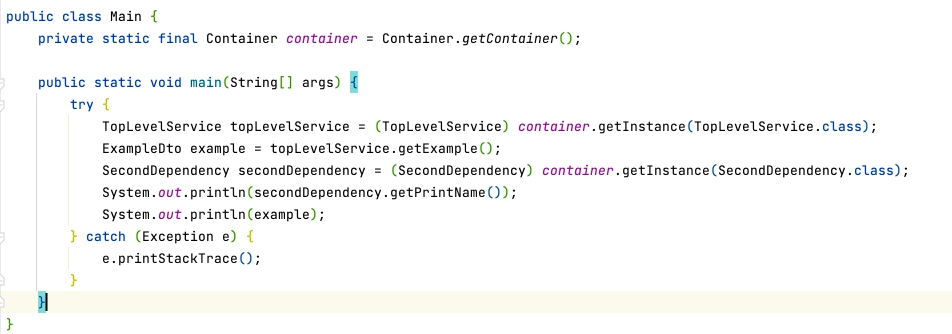

# Container
This is a primitive implementation of dependency injection

### Available annotation:
- @Autowired
- @Component
- @PostConstruct
- @Qualifier

### Description:
Dependency injection is implemented through a constructor annotated with @Autowired annotation
If there is no annotation, the first available constructor for implementation is selected.

In order for a container to instantiate a class, the class must be annotated with @Component

All created objects are stored in the container.
The container is implemented as a singleton, which allows you to use already created beans at any time of execution.

If we have several implementations of the same interface, we can use the @Qualifier annotation, in this solution, the annotation can be used on the class and on the constructor to select the preferred implementation.

### How to use:
The project has a Main class responsible for starting the project.
It has a container field, by calling its getInstance() method, all dependencies are injected and the main entity is created.

*photo of main class for example*

Here we can see the creation of different test entities using the container

### Project structure:
- Model
- Service
- Util